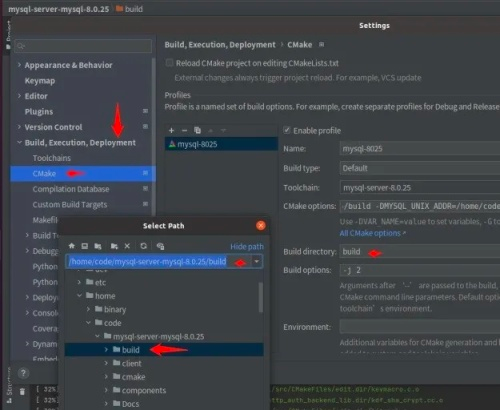

通过 CLion 调试 MySQL 源代码，需将 MySQL 编译路径与 MySQL 安装路径的配置统一。
1. 将下载的源代码放入 home 目录中
2. 解压源代码，并在源代码目录下创建 build 和 /build/data 两个目录
3. 配置 CLion 的 Cmake 的编译目

4. 配置 CLion 的 Cmake 的编译参数

-DCMAKE_BUILD_TYPE=Debug 
-DCMAKE_INSTALL_PREFIX=/Users/xxx/code/cpp/mysql-server/build 
-DMYSQL_DATADIR=/Users/xxx/code/cpp/mysql-server/build/data 
-DMYSQL_UNIX_ADDR=/Users/xxx/code/cpp/mysql-server/build/data/mysql.sock 
-DMYSQL_TCP_PORT=6606 
-DWITH_MYISAM_STORAGE_ENGINE=1 
-DWITH_INNOBASE_STORAGE_ENGINE=1 
-DDOWNLOAD_BOOST=1 
-DWITH_BOOST=/Users/xxx/code/cpp/mysql-server/build/boost 
–DWITH_EXAMPLE_STORAGE_ENGINE=1

5. 编译 

    cd /Users/xxx/code/cpp/mysql-server/build

    make -j 8

6. MySQL 数据库初始化

    cd /Users/xxx/code/cpp/mysql-server/build
    ./sql/mysqld --basedir=/Users/xxx/code/cpp/mysql-server/build --datadir=/Users/xxx/code/cpp/mysql-server/build/data --initialize-insecure --user=mysql
